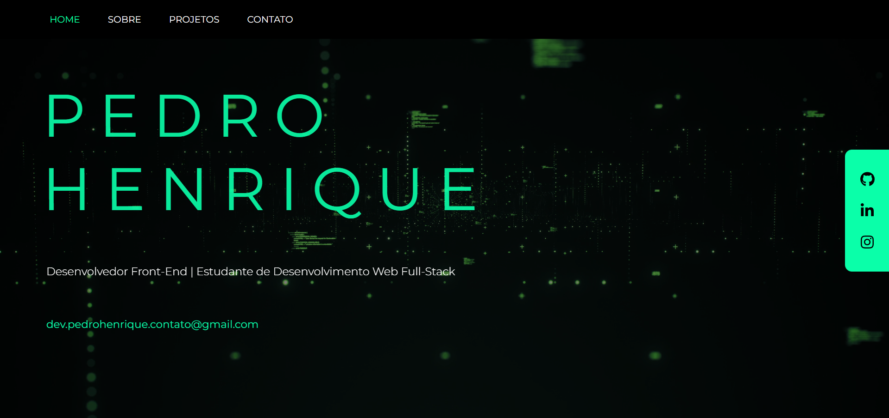

# 🌐 Portfólio Pessoal - Projeto em React

Este projeto é o meu site de portfólio pessoal, desenvolvido com **React.js**. Ele apresenta meus serviços, habilidades e formas de contato de maneira moderna, animada e **totalmente responsiva**.

---

## 🚀 Tecnologias e bibliotecas utilizadas

- **React.js**
- **React Router DOM**
  - Navegação entre páginas com `Router` e `useLocation`
- **Hooks do React**
  - `useState` e `useEffect` para animações ao carregar e trocar páginas
- **Font Awesome**
  - Ícones personalizados e estilizados
- **React Mouse Particles**
  - Efeito visual com partículas que seguem o movimento do mouse
- **CSS Responsivo**
  - Layout adaptado para todos os dispositivos (desktop, tablet e celular)

---

## 📸 Preview
 


---

📍 Funcionalidades:
✅ Animações suaves com React Hooks (useEffect e useState)
✅ Efeito visual com partículas (React Mouse Particles)
✅ Navegação fluida entre páginas (SPA)
✅ Ícones estilizados com Font Awesome
✅ Design responsivo para qualquer dispositivo
✅ Compatível com todos os navegadores


## 🔗 Acesse o site

👉 https://devpedrohenrique25.github.io/Portifolio/

---

## 📁 Como rodar localmente

```bash
git clone https://github.com/devpedrohenrique25/Portifolio.git
cd Portifolio
npm install
npm start
